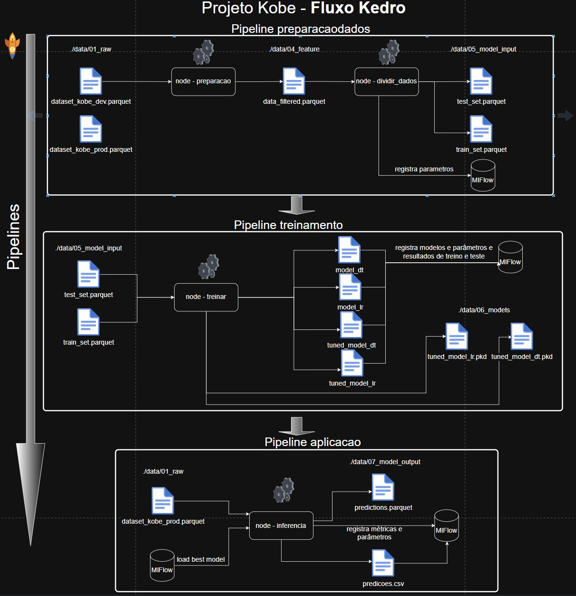
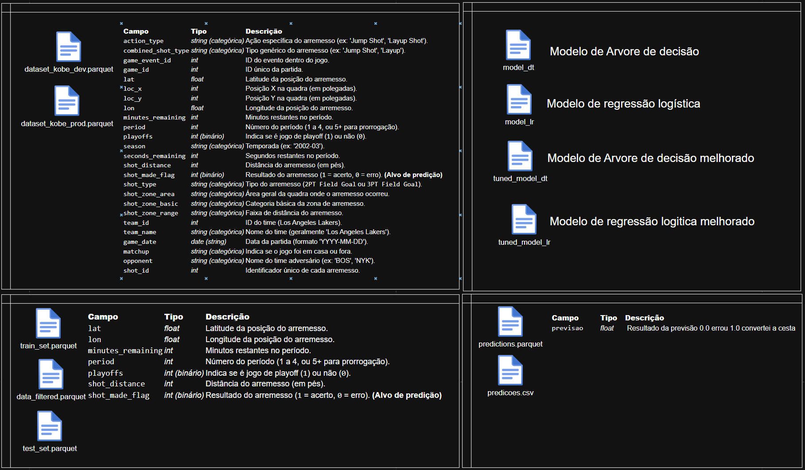
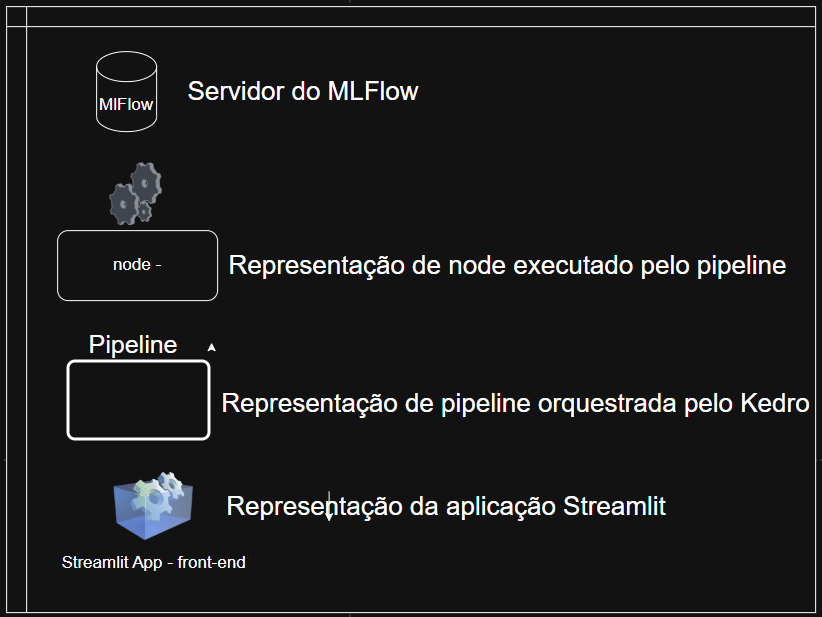
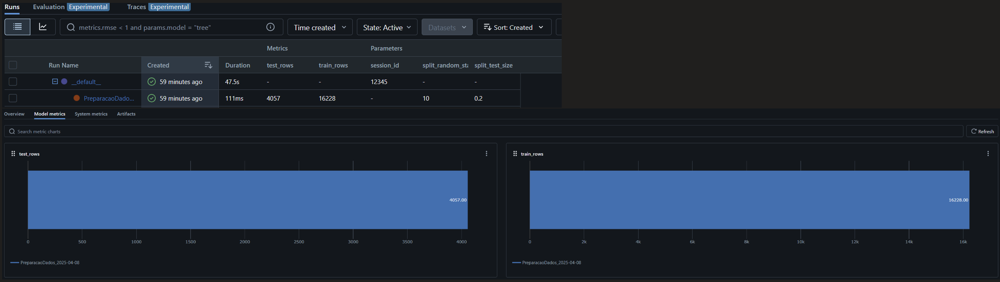

# Projeto kobe

### Link para o repositório: https://github.com/FTNeves80/Projeto_Kobe

## 1.Diagrama do projeto


### 2. Como as ferramentas Streamlit, MLFlow, PyCaret e Scikit-Learn auxiliam na construção dos pipelines descritos anteriormente? A resposta deve abranger os seguintes aspectos:
   #### 2.1 Rastreamento de experimentos:
    Com o MLFlow é possível registrar as métricas, artefatos e parâmetros de forma automática. O MLFlow possui uma interface onde você pode consultas e comparar todas as informações registradas tanto atuais como historicamente. Ele cria uma espece de central de informações muito útil para a utilização de controle e registro do ciclo de desenvolvimento dos modelos.
                
   #### 2.2 Funções de treinamento:
    O Scikit-Learn é uma biblioteca poderosa e bastante utilizada no mercado, com uma grande variedade de algoritmos para treinamento de modelos. Já o PyCaret ajuda a automatizar esse processo, permitindo treinar diversos modelos, comparar resultados e ajustar hiperparâmetros com poucas linhas de código. Isso economiza tempo e facilita a obtenção de bons resultados de forma mais eficiente.
                
   #### 2.3 Monitoramento da saúde do modelo:
    O monitoramento da saúde do modelo pode ser feito registrando periodicamente as métricas de performance no MLflow, como AUC, F1-score, Log Loss, entre outras. Isso ajuda a perceber se o modelo está piorando com o tempo (drift de dados ou de conceito). Com isso, conseguimos identificar quando é hora de reavaliar ou atualizar o modelo. Ferramentas como o PyCaret facilitam essa parte, pois permitem reusar facilmente o pipeline de treino e avaliação para comparar com versões anteriores.
    
   #### 2.4 Atualização de modelo:
    Utilizando PyCaret e MLflow, a atualização de um modelo pode ser feita de forma automatizada. É possível configurar um pipeline para retreinar o modelo com dados mais recentes ou com novos parâmetros, registrando uma nova versão no MLflow. A partir daí, você pode promover essa nova versão para produção, mantendo o histórico e comparando com versões anteriores.
                
   #### 2.5 Provisionamento (Deployment).
    O MLflow permite que você sirva o modelo em um servidor, gerando uma API que recebe inputs e retorna previsões. Já o Streamlit pode ser usado para construir uma interface gráfica (front-end) que consome essa API, permitindo a visualização e interação com o modelo de forma simples e intuitiva.

### 4 Com base no diagrama realizado na questão 2, aponte os artefatos que serão criados ao longo de um projeto. Para cada artefato, a descrição detalhada de sua composição.




### 4 Implemente o pipeline de processamento de dados com o mlflow, rodada (run) com o nome "PreparacaoDados":
    4.1 A dimensão resultate do Dataser data_filtered.parquet após seleção e exclusão de nulos passa a ser (20285, 7)


    4.2 Explique como a escolha de treino e teste afetam o resultado do modelo final. Quais estratégias ajudam a minimizar os efeitos de viés de dados.
        A escolha da proporção entre treino e teste afeta diretamente a qualidade do modelo. Se você reduz muito os dados de treino, o modelo aprende pouco e tem desempenho ruim. Se reduz demais o teste, você perde a referência se ele está generalizando bem. Um equilíbrio comum é 80% treino e 20% teste.Para minimizar o viés, é importante usar amostragem estratificada (manter a proporção das classes) e aplicar validação cruzada (cross-validation), que avalia o modelo em diferentes subconjuntos dos dados, reduzindo a chance de viés por divisão específica


    4.3 Registre os parâmetros (% teste) e métricas (tamanho de cada base) no MlFlow - Registro dos parâmetros no MLFlow



### 6 Implementar o pipeline de treinamento do modelo com o MlFlow usando o nome "Treinamento"
    1. Com os dados separados para treinamento, treine um modelo com regressão logística do sklearn usando a biblioteca pyCaret.
    2. Registre a função custo "log loss" usando a base de teste
    3. Com os dados separados para treinamento, treine um modelo de árvore de decisão do sklearn usando a biblioteca pyCaret.
    4. Registre a função custo "log loss" e F1_score para o modelo de árvore.
    5. Selecione um dos dois modelos para finalização e justifique sua escolha.

    O fluxo de treinamento executou quatro modelos: dois de Regressão Logística e dois de Árvore de Decisão. Inicialmente, foi realizado um treinamento básico para cada tipo de modelo com a configuração padrão definida na experiência. Em seguida, para cada tipo de modelo, foi aplicado um processo de ajuste de hiperparâmetros (tuning), como mostrado na imagem abaixo. Após o treinamento, os dois modelos otimizados — tanto a Regressão Logística quanto a Árvore de Decisão — foram avaliados com o dataset de teste. Os resultados da avaliação estão apresentados na aba de teste dos modelos, onde foram registrados métricas como log loss e F1 score.
      
    Escolha do modelo:
    Com base na análise da tabela e na comparação dos indicadores de desempenho entre os modelos Logistic Regression (lr) e Decision Tree (dt), a escolha final foi pelo Logistic Regression ajustado (lr). Esse modelo apresentou melhor desempenho nas principais métricas, com maior F1-score, maior Recall e menor Log Loss, sendo, portanto, o mais indicado para o problema em questão.
    
    Abaixo seguem os prints do MLFlow:


## Overview

This is your new Kedro project, which was generated using `kedro 0.19.12`.

exemplo de sintaxe de MD [Kedro documentation](https://docs.kedro.org) to get started.

### JupyterLab
## Project dependencies


```
Exmplo de marcaçao MD kedro jupyter notebook
```

### Como executar o projeto Ajudar essa respostas
1-kedro run
2-subir o modelo
3-moninotar via mlflow
4-Visualizar o front-end


