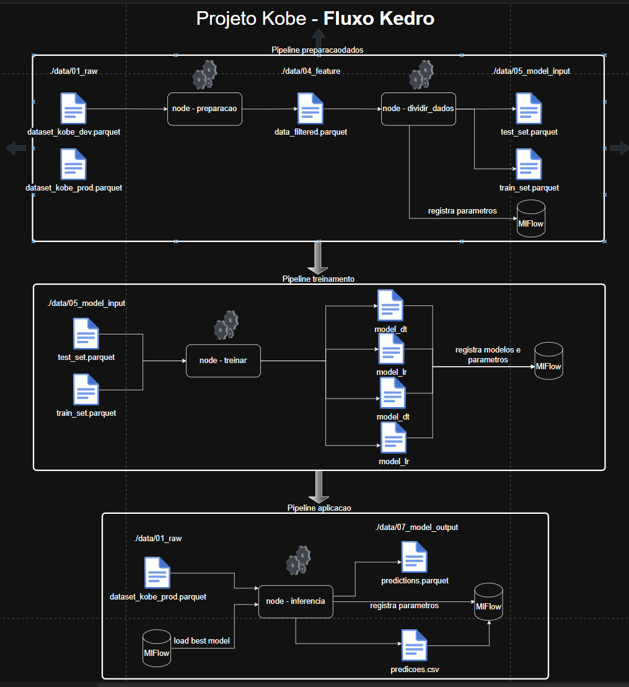

# Projeto kobe

# Link para o repositório: https://github.com/FTNeves80/Projeto_Kobe


## Overview

This is your new Kedro project, which was generated using `kedro 0.19.12`.

exemplo de sintaxe de MD [Kedro documentation](https://docs.kedro.org) to get started.

### JupyterLab
## Project dependencies


```
Exmplo de marcaçao MD kedro jupyter notebook
```

### IPython
And if you want to run an IPython session:

## Diagrama do projeto



Analisando a tabela, vamos comparar os principais indicadores de desempenho entre os modelos lr (Logistic Regression) e dt (Decision Tree):

Métrica	Logistic Regression (lr)	Decision Tree (dt)	Melhor
AUC	0.5921	0.5923	Empate (quase idênticos)
Accuracy	0.5682	0.5883	dt
F1 Score	0.5397	0.4644	lr
Recall	0.5296	0.3758	lr
Log Loss	0.6821	0.7171	lr (menor é melhor)
🧠 Análise
F1 Score e Recall são métricas muito importantes quando o dataset é desbalanceado ou você quer equilibrar falsos positivos e falsos negativos.

Log Loss penaliza muito previsões com alta confiança e erradas — e o lr também teve melhor resultado aqui.

A AUC praticamente empatou, com vantagem minúscula para a árvore.

A Accuracy foi maior na dt, mas isso pode ser enganoso em problemas com desequilíbrio nas classes.

✅ Conclusão
Você deve escolher o Logistic Regression (lr), porque:

Ele teve melhor F1, melhor Recall, menor Log Loss.

A pequena perda em Accuracy e AUC não compensa a perda nos outros pontos, principalmente se seu problema é sensível a erros de classificação.

Se quiser, posso te ajudar a registrar isso no MLflow ou usar como base para uma próxima inferência!