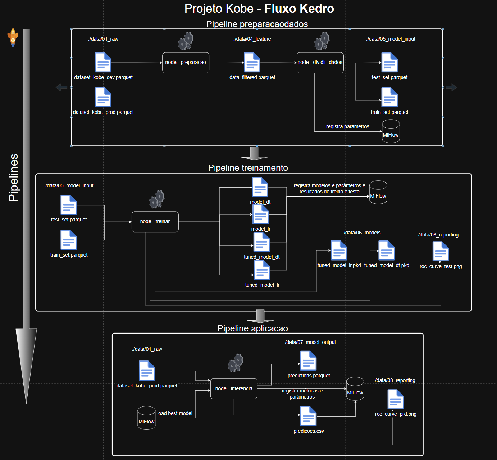

# Projeto kobe

### Link para o repositório: https://github.com/FTNeves80/Projeto_Kobe

## 1.Diagrama do projeto

### 2. Como as ferramentas Streamlit, MLFlow, PyCaret e Scikit-Learn auxiliam na construção dos pipelines descritos anteriormente? A resposta deve abranger os seguintes aspectos:
   #### 2.1 Rastreamento de experimentos:
    Com o MLFlow é possível registrar as métricas, artefatos e parâmetros de forma automática. 
    O MLFlow possui uma interface onde você pode consultas e comparar todas as informações registradas tanto atuais como historicamente. 
    Ele cria uma espece de central de informações muito útil para a utilização de controle e registro do ciclo de desenvolvimento dos modelos.
                
   #### 2.2 Funções de treinamento:
    O Scikit-Learn é uma biblioteca poderosa e bastante utilizada no mercado, com uma grande variedade de algoritmos para treinamento de modelos. 
    Já o PyCaret ajuda a automatizar esse processo, permitindo treinar diversos modelos, comparar resultados e ajustar hiperparâmetros com poucas linhas de código. 
    Isso economiza tempo e facilita a obtenção de bons resultados de forma mais eficiente.
                
   #### 2.3 Monitoramento da saúde do modelo:
    O monitoramento da saúde do modelo pode ser feito registrando periodicamente as métricas de performance no MLflow, como AUC, 
    F1-score, Log Loss, entre outras. Isso ajuda a perceber se o modelo está piorando com o tempo (drift de dados ou de conceito). 
    Com isso, conseguimos identificar quando é hora de reavaliar ou atualizar o modelo. Ferramentas como o PyCaret facilitam essa parte, 
    pois permitem reusar facilmente o pipeline de treino e avaliação para comparar com versões anteriores.
    
   #### 2.4 Atualização de modelo:
    Utilizando PyCaret e MLflow, a atualização de um modelo pode ser feita de forma automatizada. 
    É possível configurar um pipeline para retreinar o modelo com dados mais recentes ou com novos parâmetros, registrando uma nova versão no MLflow. 
    A partir daí, você pode promover essa nova versão para produção, mantendo o histórico e comparando com versões anteriores.
                
   #### 2.5 Provisionamento (Deployment).
    O MLflow permite que você sirva o modelo em um servidor, gerando uma API que recebe inputs e retorna previsões. 
    Já o Streamlit pode ser usado para construir uma interface gráfica (front-end) que consome essa API, permitindo a visualização e interação com o modelo de forma simples e intuitiva.

### 4 Com base no diagrama realizado na questão 2, aponte os artefatos que serão criados ao longo de um projeto. Para cada artefato, a descrição detalhada de sua composição.

### 4 Implemente o pipeline de processamento de dados com o mlflow, rodada (run) com o nome "PreparacaoDados":
    4.1 A dimensão resultate do Dataser data_filtered.parquet após seleção e exclusão de nulos passa a ser (20285, 7)

    4.2 Explique como a escolha de treino e teste afetam o resultado do modelo final. Quais estratégias ajudam a minimizar os efeitos de viés de dados.
        A escolha da proporção entre treino e teste afeta diretamente a qualidade do modelo. Se você reduz muito os dados de treino, o modelo aprende pouco e tem desempenho ruim. 
        Se reduz demais o teste, você perde a referência se ele está generalizando bem. Um equilíbrio comum é 80% treino e 20% teste.Para minimizar o viés, 
        é importante usar amostragem estratificada (manter a proporção das classes) e aplicar validação cruzada (cross-validation), que avalia o modelo em diferentes subconjuntos dos dados, 
        reduzindo a chance de viés por divisão específica

    4.3 Registre os parâmetros (% teste) e métricas (tamanho de cada base) no MlFlow - Registro dos parâmetros no MLFlow

### 6 Implementar o pipeline de treinamento do modelo com o MlFlow usando o nome "Treinamento"
    1. Com os dados separados para treinamento, treine um modelo com regressão logística do sklearn usando a biblioteca pyCaret.
    2. Registre a função custo "log loss" usando a base de teste
    3. Com os dados separados para treinamento, treine um modelo de árvore de decisão do sklearn usando a biblioteca pyCaret.
    4. Registre a função custo "log loss" e F1_score para o modelo de árvore.
    5. Selecione um dos dois modelos para finalização e justifique sua escolha.

    O fluxo de treinamento executou quatro modelos: dois de Regressão Logística e dois de Árvore de Decisão. 
    Inicialmente, foi realizado um treinamento básico para cada tipo de modelo com a configuração padrão definida na experiência. 
    Em seguida, para cada tipo de modelo, foi aplicado um processo de ajuste de hiperparâmetros (tuning), como mostrado na imagem abaixo. 
    Após o treinamento, os dois modelos otimizados — tanto a Regressão Logística quanto a Árvore de Decisão — foram avaliados com o dataset de teste. 
    Os resultados da avaliação estão apresentados na aba de teste dos modelos, onde foram registrados métricas como log loss e F1 score.
      
    Escolha do modelo:
    Com base na análise da tabela e na comparação dos indicadores de desempenho entre os modelos Logistic Regression (lr) e Decision Tree (dt), 
    a escolha final foi pelo Logistic Regression ajustado (lr). Esse modelo apresentou melhor desempenho nas principais métricas, com maior F1-score, 
    maior Recall e menor Log Loss, sendo, portanto, o mais indicado para o problema em questão.
    
    Abaixo seguem os prints do MLFlow:

### 7 Registre o modelo de classificação e o sirva através do MLFlow (ou como uma API local, ou embarcando o modelo na aplicação). Desenvolva um pipeline de aplicação (aplicacao.py) para carregar a base de produção (/data/raw/dataset_kobe_prod.parquet) e aplicar o modelo. Nomeie a rodada (run) do mlflow como “PipelineAplicacao” e publique, tanto uma tabela com os resultados obtidos (artefato como .parquet), quanto log as métricas do novo log loss e f1_score do modelo.

Abaixo a combinação de prints extraídos dos registros do MLFlow:

        
        
        7.1.1 O modelo é aderente a essa nova base?
        
        O modelo não é aderente à nova base, pois não foi capaz de generalizar bem. 
        O desempenho piorou bastante. Podemos verificar isso analisando os indicadores de performance: o F1-score, que na base de teste foi de 0,578, caiu para 0,229 na base de produção, 
        o que representa uma queda drástica de mais de 50%.Além disso, 
        o Log Loss aumentou consideravelmente, indicando uma piora relevante no desempenho. Na base de teste, o Log Loss foi 0,676, enquanto na base de produção subiu para 4,637.
        
        
        7.1.2 O que mudou entre uma base e outra? Justifique.
        
        Analisando as bases de treino, teste e produção, fica claro que houve uma mudança significativa no posicionamento dos arremessos. As regiões da quadra onde os arremessos ocorrem 
        nas bases de treino e teste são totalmente diferentes daquelas observadas na base de produção. Essa mudança de padrão justifica a queda no desempenho do modelo.
        No gráfico abaixo, é possível visualizar os dados plotados das três bases, e fica evidente que as posições dos arremessos na produção estão concentradas em áreas distintas das usadas no treino e teste.
        Na base RAW foi identificado um campo chamado "shot_type" tipo de arremesso, que diferencia entre arremessos de 2 pontos e 3 pontos. Segundo a regra da partida, esses tipos partem de regiões diferentes da quadra. 
        As bases de treino e teste são compostas por arremessos de 2 pontos, enquanto a base de produção contém arremessos de 3 pontos. Essa diferença estrutural nos dados reforça o motivo da queda de performance do modelo.
        Os gráficos a seguir ilustram essas mudanças e ajudam a embasar essa análise.

    

        7.2 Descreva como podemos monitorar a saúde do modelo no cenário com e sem a disponibilidade da variável resposta para o modelo em operação.

        Para monitorar a saúde de um modelo em produção, a abordagem muda dependendo da disponibilidade da variável resposta (target).
        Com a variável resposta, é possível acompanhar diretamente o desempenho do modelo ao longo do tempo usando métricas como acurácia, F1-score ou erro médio.
        Assim, conseguimos identificar se houve perda de performance de forma objetiva.Sem a variável resposta, o monitoramento precisa ser indireto. 
        Podemos acompanhar a distribuição das entradas (features) e verificar se estão mudando com o tempo — isso é conhecido como data drift. 
        Um exemplo clássico seria um modelo que prediz o valor de imóveis em uma cidade pequena, e de repente é construído um grande condomínio que altera completamente a dinâmica da região. 
        Isso muda o padrão dos dados, mesmo sem termos a variável resposta. 
        Outra forma de monitorar o data drift é acumular os dados recentes que chegam ao modelo, calcular a distribuição dessas variáveis e comparar com a distribuição dos dados usados no treino. 
        Podemos usar testes estatísticos para isso ou até treinar um classificador para tentar distinguir se os dados são antigos ou novos. 
        Se ele tiver um desempenho alto, é sinal de que os dados mudaram.
        Também vale observar mudanças no comportamento da saída do modelo (distribuição das predições) e na importância das features ao longo do tempo. 
        Se o modelo começa a depender de outras variáveis para tomar decisão, pode ser um indício de que algo mudou.

        7.3 Descreva as estratégias reativa e preditiva de retreinamento para o modelo em operação.

        Existem duas formas principais de definir quando retreinar um modelo em produção: a estratégia reativa e a estratégia preditiva.
        A estratégia reativa é baseada em responder a um problema identificado. Ou seja, só retreinamos o modelo quando detectamos que ele perdeu desempenho, 
        geralmente comparando o modelo atual com um novo modelo treinado com dados mais recentes. Para isso, é necessário ter a variável resposta disponível. 
        Um bom exemplo seria observar queda no F1-score e, a partir disso, acionar o processo de retreinamento.
        Já a estratégia preditiva tenta antecipar problemas antes que a performance do modelo caia. Isso pode ser feito monitorando sinais de que o ambiente mudou, 
        como alterações na distribuição das features (data drift) ou mudanças no significado de uma variável (feature drift). 
        Mesmo sem o target, conseguimos identificar essas mudanças e decidir por um retreinamento preventivo, evitando que o modelo opere com baixa qualidade.

### 8 Implemente um dashboard de monitoramento da operação usando Streamlit.
        Foi desenvolvida uma aplicação web utilizando Streamlit para realizar inferência em tempo real, com base no modelo treinado e servido via MLflow. Segume abaixo o print da aplicação:
    

### Como executar o projeto Ajudar essa respostas

1-kedro run
2-mlflow ui
3-mlflow models serve --model-uri models:/runs:/c37b973232204389932db377de875f41/model/1 --env-manager=local --port 5001
4-..\streamlit> streamlit run app.py

